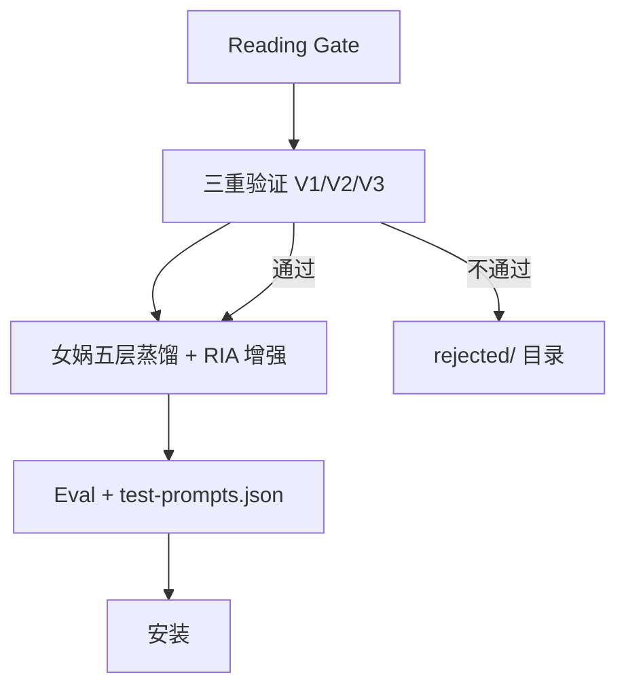

# Design: weread-to-skill-factory 增强方案（Adler + RIA + 三重验证）

> Generated by office-hours on 2026-06-10
> Status: DRAFT
> Mode: Builder
> Harness: Evidence First + No Fabrication + TDD
> Version: 3.0 (CEO Review 修订版)

---

## 1. Problem Statement（问题陈述）

### 1.1 Viva 环节系统性缺陷

| 问题 | 具体表现 | 影响 | 严重程度 |
|------|---------|------|---------|
| 问题太泛 | "这章讲了什么？" | 无法验证深度理解 | 高 |
| 没有结合划线/批注 | 不用用户实际阅读痕迹 | 无法个性化 | 高 |
| 没有结构化 | 10 个问题东问一个西问一个 | 无法系统性评估 | 高 |
| 只验证读过 | 不验证理解深度 | 无法判断是否真正掌握 | 高 |
| 缺乏应用能力测试 | 不问"怎么用" | 无法判断是否能实际应用 | 中 |

### 1.2 蒸馏质量系统性缺陷

| 问题 | 具体表现 | 影响 | 严重程度 |
|------|---------|------|---------|
| 触发条件泛 | description 写"用户需要思考时" | Agent 不知道什么时候调用 | 高 |
| 缺可执行步骤 | skill 只有理论没有行动指南 | 无法实际使用 | 高 |
| 边界不清 | 不知道什么时候不该用 | 可能误触发 | 高 |
| 缺案例 | skill 太抽象 | 无法类比应用 | 中 |
| 缺原文引用 | 没有 R（Reading） | 无法追溯来源 | 中 |
| 缺自述 | 没有 I（Interpretation） | 无法理解核心思想 | 中 |
| 缺执行步骤 | 没有 E（Execution） | 无法实际操作 | 高 |
| 缺边界 | 没有 B（Boundary） | 无法判断适用范围 | 高 |

### 1.3 验证体系系统性缺陷

| 问题 | 具体表现 | 影响 | 严重程度 |
|------|---------|------|---------|
| 无三重验证 | 只验证读过，不验证值得做 | 可能蒸馏出低价值 skill | 高 |
| 无诱饵测试 | 不知道会不会误触发 | 可能乱激活 | 高 |
| 无触发精准度验证 | 只有 smoke test 验证内容 | 无法验证触发时机 | 高 |
| 无跨域验证 | 不验证方法论的稳定性 | 可能蒸馏出偶然出现的观点 | 中 |
| 无预测力测试 | 不验证方法论的外推能力 | 可能蒸馏出只能复述的例子 | 中 |
| 无独特性检验 | 不验证方法论的独特价值 | 可能蒸馏出常识 | 中 |

---

## 2. Design Principles（设计原则）

### 2.1 核心不变原则

| 元素 | 状态 | 原因 | 详细说明 |
|------|------|------|---------|
| 女娲五层蒸馏法 | 不变 | 核心骨架 | 表达DNA→心智模型→决策启发式→反模式→诚实边界 |
| Reading Gate | 不变 | 唯一入口 | 证明读过，20分+30分口试 |
| 微信读书证据链 | 不变 | 护城河 | 划线/批注/完成度 |
| RIA/Adler/三重验证 | 新增 | 调味料 | 增强不替代 |

### 2.2 Harness Engineering 约束

**本次增强必须遵守 harness-engineering.md 的所有约束：**

#### 2.2.1 Evidence First（证据优先原则）

任何结论之前必须先输出：

```markdown
### Immutable Evidence（不可修改事实）

- 当前状态
- 当前 book
- 当前 gate
- 当前文件
- 当前权限
- 当前用户批准情况

### Source Evidence（引用来源）

- 文件路径
- 行为来源
- 用户指令来源

**禁止**：只输出结论，不输出证据。

**要求**：先输出证据，再输出推理。
```

#### 2.2.2 No Fabrication Rule（禁止编造规则）

```markdown
### 禁止编造

- 编造文件内容
- 编造运行结果
- 编造 eval 分数
- 编造 gate 通过情况
- 编造 API 返回
- 编造安装成功
- 编造状态迁移

### 没有证据时

必须输出 `UNKNOWN`，而不是猜测。
```

#### 2.2.3 Runtime Trace（运行追踪）

每一步必须输出：

```markdown
Current State: [状态名]
Current Action: [动作名]
Input: [输入]
Output: [输出]
Next State: [下一状态]
Reason: [原因]
```

**禁止**：只输出最终结果。

#### 2.2.4 Gate Trace（Gate 追踪）

每个 gate 必须输出：

```markdown
Gate: [Gate 名称]
Threshold: [阈值]
Observed: [观察值]
Result: [PASS / FAIL / UNKNOWN]
Evidence: [证据来源]
```

**禁止**：输出「Gate passed」而不给证据。

#### 2.2.5 Modification Trace（修改追踪）

每次修改必须输出：

```markdown
File: [文件路径]
Section: [修改位置]
Before: [修改前内容]
After: [修改后内容]
Reason: [修改原因]
```

如果无法读取 Before，必须输出：

```markdown
Before: UNKNOWN
```

**禁止**：伪造旧内容。

#### 2.2.6 State Transition Trace（状态转换追踪）

每次状态变化必须输出：

```markdown
Previous State: [状态名]
Trigger: [触发原因]
Evidence: [证据]
New State: [状态名]
```

**禁止**：隐式跳转。

#### 2.2.7 Eval Harness（Eval 约束）

eval 阶段必须输出：

```markdown
Test Name: [测试名]
Input: [输入]
Expected: [期望输出]
Observed: [实际输出]
Result: [PASS / FAIL / UNKNOWN]
Failure Reason: [失败原因，如果失败]
```

**禁止**：输出「全部通过」而没有测试记录。

#### 2.2.8 Failure Visibility（失败可见性）

发现错误时：

**禁止**：
- 隐藏错误
- 自动修复后假装没有问题

**必须输出**：

```markdown
Issue: [问题描述]
Impact: [影响范围]
Evidence: [证据]
Recovery Plan: [恢复计划]
Current State: [当前状态]
```

#### 2.2.9 UNKNOWN Discipline（UNKNOWN 纪律）

当证据不足以覆盖全书时，必须声明：

```markdown
Scope: [实际覆盖范围]
Limitation: [限制说明]
Evidence Source: [证据来源]
```

**禁止**：声称覆盖全书但实际只有部分证据。

#### 2.2.10 Anti-Goodhart Rule（反古德哈特定律）

**禁止**：为了通过验证而生成只能通过验证、实际不可用的垃圾结果。

**验证目标**：不是「Pass Tests」，而是「Produce Auditable Reality」。

#### 2.2.11 Scope-Limited Declaration（范围限制声明）

当证据不足以覆盖全书时，必须声明：

```markdown
Scope: [实际覆盖范围]
Limitation: [限制说明]
Evidence Source: [证据来源]
```

**禁止**：声称覆盖全书但实际只有部分证据。

#### 2.2.12 Harness Completion Check（约束完成检查）

每个阶段完成后，必须检查：

1. 是否输出了 Runtime Trace？
2. 是否输出了 Gate Trace（如果适用）？
3. 是否输出了 Modification Trace（如果适用）？
4. 是否有编造内容？
5. 是否有 UNKNOWN 未说明原因？

如果任何一项未满足，不得进入下一状态。

#### 2.2.13 Termination Audit（终止审计）

进入 TERMINATED 时，必须输出：

```markdown
=== TERMINATION AUDIT ===
Final State: TERMINATED
Exit Reason: [原因]
Total State Transitions: [次数]
Total Gates: [次数]
Total Pass: [次数]
Total Fail: [次数]
Total UNKNOWN: [次数]
Fabrication Detected: [YES / NO]
Evidence Ledger Complete: [YES / NO]
=== END AUDIT ===
```

### 2.3 TDD 驱动原则

**本次增强必须遵守 TDD 原则：**

```
NO IMPLEMENTATION WITHOUT A FAILING TEST FIRST
```

每个增强点必须：
1. 先写测试（定义期望行为）
2. 看测试失败（验证测试有效）
3. 写最小实现（让测试通过）
4. 重构（保持测试绿色）

#### 2.3.1 RED — Write Failing Test

写一个最小的测试，展示应该发生什么。

**好的测试：**
```python
def test_enhanced_viva_has_10_questions():
    protocol = EnhancedVivaProtocol()
    questions = protocol.generate_questions(user_highlights=[], user_notes=[])
    assert len(questions) == 10
```

清晰的名称，测试真实的行为，只测试一件事。

**坏的测试：**
```python
def test_viva_works():
    protocol = EnhancedVivaProtocol()
    questions = protocol.generate_questions()
    assert len(questions) > 0  # 太模糊
```

模糊的名称，测试的是 mock 而不是真实代码。

**要求：**
- 每个测试只测试一个行为
- 清晰的描述性名称（名称里有"and"？拆分它）
- 真实代码，不是 mock（除非真的不可避免）
- 名称描述行为，不是实现

#### 2.3.2 Verify RED — Watch It Fail

**必须。不能跳过。**

```bash
# 用 terminal 工具运行特定测试
pytest tests/test_enhanced_viva.py::test_enhanced_viva_has_10_questions -v
```

确认：
- 测试失败（不是拼写错误导致的错误）
- 失败消息是预期的
- 因为功能缺失而失败

**测试立即通过？** 你在测试现有行为。修改测试。

**测试报错？** 修复错误，重新运行直到正确失败。

#### 2.3.3 GREEN — Minimal Code

写最简单的代码让测试通过。不多写。

**好的：**
```python
def generate_questions(user_highlights, user_notes):
    return [Question(f"Q{i}") for i in range(1, 11)]  # 刚好 10 个
```

**坏的：**
```python
def generate_questions(user_highlights, user_notes):
    questions = []
    for i in range(1, 11):
        q = Question(f"Q{i}")
        q.set_difficulty("medium")  # 多余！
        q.set_category("understanding")  # 多余！
        questions.append(q)
    return questions
```

不要添加功能、重构其他代码、或"改进"超出测试范围。

**GREEN 阶段可以作弊：**
- 硬编码返回值
- 复制粘贴
- 重复代码
- 跳过边界情况

在 REFACTOR 阶段修复。

#### 2.3.4 Verify GREEN — Watch It Pass

**必须。**

```bash
# 运行特定测试
pytest tests/test_enhanced_viva.py::test_enhanced_viva_has_10_questions -v

# 然后运行所有测试检查回归
pytest tests/ -q
```

确认：
- 测试通过
- 其他测试仍然通过
- 输出干净（没有错误、警告）

**测试失败？** 修复代码，不是修改测试。

**其他测试失败？** 立即修复回归。

#### 2.3.5 REFACTOR — Clean Up

只在绿色之后：
- 移除重复
- 改进名称
- 提取助手
- 简化表达

保持测试绿色。不要添加行为。

**如果重构期间测试失败？** 立即撤销。更小的步骤。

#### 2.3.6 Repeat

下一个失败测试，下一个行为。一个周期一个周期来。

### 2.4 Anti-Patterns（审计发现的反模式）

以下反模式在 v1.0 final forensic audit 中被发现。必须避免。

#### 2.4.1 Static Analysis Masquerading as Eval

**问题**：eval 的 Observed 字段只是对 SKILL.md 规则的静态分析（"根据 SKILL.md 诊断问题 1 → 是"），而非实际调用 skill 后观察到的行为。

**为什么危险**：静态分析只能验证"规则写对了"，不能验证"skill 实际按规则运行"。这等于用需求文档证明代码正确。

**正确做法**：
- Observed 必须来自实际调用 skill（通过 delegate_task、terminal、或 agent 执行）
- 如果无法实际调用，必须标为 WEAK PASS 并说明原因
- 禁止用"根据 SKILL.md 应该..."作为 Observed

**反模式示例**：
```
Observed：根据 SKILL.md 诊断问题 1「当前任务是否需要先调查再行动？」→ 是。
skill 应识别为调查优先场景。
```

**正确示例**：
```
Observed：实际调用 skill，输入"我要开始一个新项目"，
skill 输出包含"先收集信息"和"brainstorming 讨论清楚"。
```

#### 2.4.2 Self-Referential Smoke Test Evidence

**问题**：smoke test 结果只存在于 final report 中，没有独立的证据文件。final report 用自己证明自己。

**为什么危险**：无法独立验证。如果 final report 声称 25/25 PASS，但没有独立日志，这个声明本身不可审计。

**正确做法**：
- smoke test 必须生成独立的日志文件（如 `smoke-test-log.md`）
- 日志文件必须包含每个测试的 Input/Expected/Observed/Result
- final report 引用日志文件，而非自己证明自己

**反模式示例**：
```
# Final Report
Smoke Test Result: 25/25 PASS
（无独立证据）
```

**正确示例**：
```
# Final Report
Smoke Test Result: 25/25 PASS
Evidence: ~/.hermes/skills/books/xxx/smoke-test-log.md
```

#### 2.4.3 Final Report Self-Proof Loop

**问题**：final report 声称所有测试通过，但验证证据只存在于 final report 本身。

**为什么危险**：形成逻辑循环——"final report 说 PASS，所以 PASS"。

**正确做法**：
- 每个 PASS 声明必须有独立证据来源
- 证据来源必须是文件系统中的实际文件，而非 final report 中的文字
- 如果无法提供独立证据，必须标为 WEAK PASS

#### 2.4.4 search_files as Functional Proof

**问题**：用 search_files 搜索到关键词，就声称功能"真实可用"。

**为什么危险**：搜索到关键词只能证明"文件中包含这个字符串"，不能证明"功能按预期工作"。

**正确做法**：
- search_files 用于验证文件存在和内容包含
- 功能验证必须通过实际调用
- 文件存在 ≠ 功能可用

#### 2.4.5 UNKNOWN Written as PASS

**问题**：将 UNKNOWN 结果写成 PASS。

**为什么危险**：UNKNOWN 表示"未验证"或"无法判断"，不是"通过"。

**正确做法**：
- UNKNOWN 必须保持 UNKNOWN
- 必须说明 UNKNOWN 的原因
- 如果 UNKNOWN 影响最终判定，必须在报告中说明

### 2.5 Eval Execution Requirements（Eval 执行要求）

#### 2.5.1 Real Execution vs Static Analysis

eval 有两种执行方式，必须区分：

| 类型 | 方法 | 可信度 | 标记 |
|------|------|--------|------|
| Real Execution | 实际调用 skill，观察输入输出 | HIGH | PASS |
| Static Analysis | 分析 SKILL.md 规则，推断行为 | LOW | WEAK PASS |

**要求**：
- 优先使用 Real Execution
- 如果只能做 Static Analysis，必须标为 WEAK PASS
- 禁止把 Static Analysis 标为 PASS

#### 2.5.2 Smoke Test Evidence Requirements

smoke test 必须满足：

1. **独立文件**：生成独立的日志文件
2. **可追踪**：每个测试有 Input/Expected/Observed/Result
3. **可验证**：日志文件可在文件系统中找到
4. **非自证**：final report 引用日志文件，不自己证明自己

#### 2.5.3 Forensic Audit Checklist

在声称 v1.0 final 前，必须通过以下检查：

| # | 检查项 | 状态 |
|---|--------|------|
| 1 | 正式 book-skill 路径存在 | PASS / FAIL |
| 2 | DRAFT 标记已移除 | PASS / FAIL |
| 3 | scope-limited 声明保留 | PASS / FAIL |
| 4 | evidence-ledger.md 有可追踪细节 | PASS / FAIL |
| 5 | eval 文件有 Observed（非模板） | PASS / FAIL |
| 6 | eval 是 Real Execution（非 Static Analysis） | PASS / WEAK |
| 7 | smoke test 有独立日志文件 | PASS / WEAK |
| 8 | final report 无自证循环 | PASS / WEAK |
| 9 | factory version 已升级 | PASS / FAIL |
| 10 | 状态机符合 final | PASS / FAIL |

---

## 3. Enhancement 1: Enhanced Viva Protocol

### 3.1 设计目标

从"证明读过"升级为"证明深度理解"，10 题结构化，结合用户划线/批注。

### 3.2 详细设计

#### 3.2.1 10 题结构模板

```markdown
## Enhanced Viva 10 题协议

### 证据层（Q1-Q3）：基于用户划线/批注

Q1: 划线追问
- 模板：「你划了「{划线原文}」，能说说当时为什么划这句吗？」
- 目的：验证阅读真实性
- 来源：user-highlights.md
- 判断标准：用户能说出自己的理解，不是复述原文
- 证据要求：必须引用具体划线

Q2: 批注追问
- 模板：「你批注了「{批注原文}」，能展开说说你的想法吗？」
- 目的：验证独立思考
- 来源：user-notes.md
- 判断标准：用户能展开说说自己的想法，不是复述批注
- 证据要求：必须引用具体批注

Q3: 关联追问
- 模板：「你的划线「{划线A}」和批注「{批注B}」有什么关系？」
- 目的：验证跨章节理解
- 来源：user-highlights.md + user-notes.md
- 判断标准：用户能说出两者的关联，不是简单重复
- 证据要求：必须引用具体划线和批注

### 深度层（Q4-Q7）：三重验证 + Adler 批判

Q4: 跨域验证（V1）
- 模板：「这个观点在书里几个地方出现过？能举个例子吗？」
- 目的：验证方法论的稳定性
- 判断标准：至少 2 个独立语境
- 证据要求：必须引用具体章节

Q5: 批判性问题（Adler）
- 模板：「作者这个观点有什么局限性？你同意吗？」
- 目的：验证批判性思考
- 判断标准：能指出至少 1 个局限
- 证据要求：必须说出具体局限

Q6: 预测力测试（V2）
- 模板：「假设你要{新场景}，你会怎么用这个方法论？具体步骤是什么？」
- 目的：验证方法论的外推能力
- 判断标准：能得出有意义的结论
- 证据要求：必须说出具体步骤

Q7: 独特性检验（V3）
- 模板：「这个观点和一般人的常识有什么不同？」
- 目的：验证独特价值理解
- 判断标准：能说出至少 1 个不同点
- 证据要求：必须说出具体不同点

### 应用层（Q8-Q10）：RIA A2/E

Q8: 反模式识别
- 模板：「什么情况下这个方法会失效？你能想到一个反例吗？」
- 目的：验证边界理解
- 判断标准：能识别至少 1 个反模式
- 证据要求：必须说出具体反模式

Q9: 应用场景（A2）
- 模板：「你打算怎么把这个方法论用到自己的{领域}？」
- 目的：验证应用场景识别
- 判断标准：能说出具体场景
- 证据要求：必须说出具体场景

Q10: 执行步骤（E）
- 模板：「具体第一步做什么？第二步呢？」
- 目的：验证可执行性
- 判断标准：能说出 1-2-3 步骤
- 证据要求：必须说出具体步骤
```

#### 3.2.2 自适应规则

```markdown
## 自适应规则

### 情况 A：划线/批注充足（≥5 条）

- Q1-Q3：用真实划线/批注
- Q4-Q10：深度追问

**判断标准：**
- 划线数量 ≥ 3
- 批注数量 ≥ 2
- 总数 ≥ 5

**执行流程：**
1. 读取 user-highlights.md，提取划线
2. 读取 user-notes.md，提取批注
3. 如果总数 ≥ 5，使用情况 A
4. 生成 Q1-Q3（基于真实划线/批注）
5. 生成 Q4-Q10（深度追问）

### 情况 B：划线/批注不足（<5 条）

- Q1-Q2：用已有的划线/批注
- Q3：跳过或合并到 Q2
- Q4-Q10：用深度问题补充

**判断标准：**
- 划线数量 < 3 或
- 批注数量 < 2 或
- 总数 < 5

**执行流程：**
1. 读取 user-highlights.md，提取划线
2. 读取 user-notes.md，提取批注
3. 如果总数 < 5，使用情况 B
4. 生成 Q1-Q2（基于已有划线/批注）
5. 跳过 Q3 或合并到 Q2
6. 生成 Q4-Q10（深度问题补充）

### 情况 C：划线/批注极少（<2 条）

- 降级策略：
  - Q1：用「你读完这章最大的收获是什么？」替代
  - Q2：跳过
  - Q3：跳过
  - Q4-Q10：全部用深度问题补充

**判断标准：**
- 划线数量 < 1 或
- 批注数量 < 1 或
- 总数 < 2

**执行流程：**
1. 读取 user-highlights.md，提取划线
2. 读取 user-notes.md，提取批注
3. 如果总数 < 2，使用情况 C
4. 生成 Q1（用替代问题）
5. 跳过 Q2-Q3
6. 生成 Q4-Q10（全部用深度问题补充）
```

#### 3.2.3 约束

```markdown
## Enhanced Viva 约束

### 红线

1. 总共只能 10 题，不能多
2. 必须结合用户实际划线/批注（如果有的话）
3. 必须覆盖三重验证（V1/V2/V3）
4. 必须覆盖 Adler 批判性问题
5. 必须覆盖 RIA A2/E
6. 必须有判断标准
7. 必须有证据要求

### 禁止

1. 禁止问"这章讲了什么？"（太泛）
2. 禁止不结合用户划线/批注就问（如果有）
3. 禁止问超过 10 个问题
4. 禁止跳过三重验证（V1/V2/V3）
5. 禁止跳过 Adler 批判性问题
6. 禁止没有判断标准
7. 禁止没有证据要求

### 质量标准

1. 每个问题必须有明确的判断标准
2. 每个问题必须有明确的证据要求
3. 每个问题必须有明确的来源
4. 每个问题必须有明确的目的
5. 每个问题必须有明确的模板
```

#### 3.2.4 实现案例（mao-zedong-early-thinking-skill）

```markdown
## 实现案例：毛泽东早期思想方法论

### 用户划线/批注（假设）

划线1：「调查研究是一切工作的基础」（第2章）
划线2：「读书是学习，使用也是学习」（第3章）
批注1：「没有调查就没有发言权，这个在项目管理中也适用」（第5章）

### Enhanced Viva 10 题

Q1: 你划了「调查研究是一切工作的基础」，能说说当时为什么划这句吗？
- 期望：用户能说出自己的理解
- 判断标准：不是复述原文，而是说出自己的理解
- 证据要求：必须引用具体划线

Q2: 你批注了「没有调查就没有发言权，这个在项目管理中也适用」，能展开说说吗？
- 期望：用户能举出项目管理的具体例子
- 判断标准：不是复述批注，而是举出具体例子
- 证据要求：必须引用具体批注

Q3: 你的划线「调查研究是一切工作的基础」和批注「没有调查就没有发言权」有什么关系？
- 期望：用户能说出两者的关联
- 判断标准：不是简单重复，而是说出关联
- 证据要求：必须引用具体划线和批注

Q4: 这个观点在书里几个地方出现过？能举个例子吗？
- 期望：用户能说出至少 2 个地方
- 判断标准：至少 2 个独立语境
- 证据要求：必须引用具体章节

Q5: 作者强调「调查研究」，但他自己有没有犯过「没有调查就下结论」的错误？
- 期望：用户能指出至少 1 个局限
- 判断标准：能说出具体局限
- 证据要求：必须说出具体局限

Q6: 假设你的团队正在争论要不要采用一个新的技术栈，你会怎么用「调查研究」这个方法论？
- 期望：用户能说出具体步骤
- 判断标准：能得出有意义的结论
- 证据要求：必须说出具体步骤

Q7: 「没有调查就没有发言权」这个观点，和一般人的直觉有什么不同？
- 期望：用户能说出至少 1 个不同点
- 判断标准：能说出具体不同点
- 证据要求：必须说出具体不同点

Q8: 什么情况下「调查研究」这个方法会失效？你能想到一个反例吗？
- 期望：用户能识别至少 1 个反模式
- 判断标准：能说出具体反模式
- 证据要求：必须说出具体反模式

Q9: 你打算怎么把「调查研究」用到自己的工作中？
- 期望：用户能说出具体场景
- 判断标准：能说出具体场景
- 证据要求：必须说出具体场景

Q10: 具体第一步做什么？第二步呢？
- 期望：用户能说出 1-2-3 步骤
- 判断标准：能说出具体步骤
- 证据要求：必须说出具体步骤
```

#### 3.2.5 TDD 测试要求

```markdown
## TDD 测试要求

### RED: 定义期望行为

**测试 1：10 题结构完整性**
```python
def test_enhanced_viva_has_10_questions():
    """验证 Enhanced Viva 有 10 个问题"""
    protocol = EnhancedVivaProtocol()
    questions = protocol.generate_questions(
        user_highlights=["划线1", "划线2"],
        user_notes=["批注1"]
    )
    assert len(questions) == 10
```

**测试 2：自适应规则覆盖**
```python
def test_enhanced_viva_adapts_to_insufficient_evidence():
    """验证 Enhanced Viva 在证据不足时能自适应"""
    protocol = EnhancedVivaProtocol()
    
    # 情况 A：充足
    questions_a = protocol.generate_questions(
        user_highlights=["划线1", "划线2", "划线3"],
        user_notes=["批注1", "批注2"]
    )
    assert len(questions_a) == 10
    assert questions_a[0].type == "划线追问"
    
    # 情况 B：不足
    questions_b = protocol.generate_questions(
        user_highlights=["划线1"],
        user_notes=[]
    )
    assert len(questions_b) == 10
    assert questions_b[0].type == "划线追问"
    
    # 情况 C：极少
    questions_c = protocol.generate_questions(
        user_highlights=[],
        user_notes=[]
    )
    assert len(questions_c) == 10
    assert questions_c[0].type == "替代问题"
```

**测试 3：约束覆盖**
```python
def test_enhanced_viva_covers_all_constraints():
    """验证 Enhanced Viva 覆盖所有约束"""
    protocol = EnhancedVivaProtocol()
    questions = protocol.generate_questions(
        user_highlights=["划线1"],
        user_notes=["批注1"]
    )
    
    # 检查三重验证
    v1_questions = [q for q in questions if q.type == "跨域验证"]
    v2_questions = [q for q in questions if q.type == "预测力测试"]
    v3_questions = [q for q in questions if q.type == "独特性检验"]
    assert len(v1_questions) >= 1
    assert len(v2_questions) >= 1
    assert len(v3_questions) >= 1
    
    # 检查 Adler 批判
    adler_questions = [q for q in questions if q.type == "批判性问题"]
    assert len(adler_questions) >= 1
    
    # 检查 RIA A2/E
    a2_questions = [q for q in questions if q.type == "应用场景"]
    e_questions = [q for q in questions if q.type == "执行步骤"]
    assert len(a2_questions) >= 1
    assert len(e_questions) >= 1
```

### GREEN: 实现最小代码

实现 enhanced-viva-protocol.md，包含：
- 10 题模板
- 自适应规则
- 约束

### REFACTOR: 优化

- 优化问题模板的表达
- 优化自适应规则的逻辑
- 优化约束的完整性

### 验证

- [ ] 10 题模板完整
- [ ] 自适应规则覆盖 3 种情况
- [ ] 约束覆盖所有红线
- [ ] 实现案例完整
- [ ] TDD 测试通过
```

#### 3.2.6 Harness 验证要求

```markdown
## Harness 验证要求

### Evidence First

每个问题必须有：
- 来源：用户划线/批注 或 三重验证/Adler/RIA
- 证据：具体是哪条划线/批注

**输出格式：**
```markdown
Question: Q1
Source: user-highlights.md
Evidence: 「调查研究是一切工作的基础」（第2章）
```

### No Fabrication

禁止：
- 编造用户划线/批注
- 编造问题答案
- 编造验证结果

**检查方法：**
1. 检查 user-highlights.md 是否存在
2. 检查 user-notes.md 是否存在
3. 检查引用的划线/批注是否真实存在

### Runtime Trace

Viva 执行时必须输出：
```markdown
Current State: VIVA_RUNNING
Current Action: Q{n}
Input: 用户回答
Output: 判断结果
Next State: VIVA_RUNNING 或 VIVA_COMPLETED
Reason: [原因]
```

### Gate Trace

每个问题必须输出：
```markdown
Gate: Q{n}
Threshold: 期望标准
Observed: 用户实际回答
Result: PASS / FAIL / UNKNOWN
Evidence: 具体证据
```

### UNKNOWN Discipline

如果无法判断用户回答是否达标，必须输出 UNKNOWN，不能猜测。

**UNKNOWN 场景：**
1. 用户回答太简短，无法判断
2. 用户回答与问题无关
3. 用户拒绝回答
4. 无法获取用户划线/批注

### Modification Trace

Viva 协议修改时必须输出：
```markdown
File: references/enhanced-viva-protocol.md
Section: [修改位置]
Before: [修改前内容]
After: [修改后内容]
Reason: [修改原因]
```

### State Transition Trace

Viva 状态变化时必须输出：
```markdown
Previous State: VIVA_RUNNING
Trigger: Q{n} 完成
Evidence: 用户回答
New State: VIVA_RUNNING 或 VIVA_COMPLETED
```

### Anti-Goodhart

禁止为了通过验证而：
- 编造用户划线/批注
- 编造问题答案
- 编造验证结果

### Scope-Limited Declaration

如果用户划线/批注不足，必须声明：
```markdown
Scope: 用户划线/批注不足
Limitation: 只能验证部分问题
Evidence Source: user-highlights.md, user-notes.md
```

### Harness Completion Check

Viva 完成后必须检查：
1. 是否输出了 Runtime Trace？
2. 是否输出了 Gate Trace？
3. 是否有编造内容？
4. 是否有 UNKNOWN 未说明原因？

### Termination Audit

Viva 终止时必须输出：
```markdown
=== VIVA TERMINATION AUDIT ===
Final State: VIVA_COMPLETED
Exit Reason: [原因]
Total Questions: [次数]
Total Pass: [次数]
Total Fail: [次数]
Total UNKNOWN: [次数]
Fabrication Detected: [YES / NO]
Evidence Complete: [YES / NO]
=== END AUDIT ===
```

---

## 4. Enhancement 2: Triple Verification

### 4.1 设计目标

在 Reading Gate 之后、女娲五层蒸馏之前，增加三重验证筛选。

### 4.2 详细设计

#### 4.2.1 三重验证模板

```markdown
## 三重验证方法论

### V1 跨域验证（Cross-domain）

**问题：** 该方法论在书中至少 2 个独立语境有佐证？

**判断标准：**
- ✅ 通过：同一方法论在不同章节、不同案例、不同场景中反复出现
- ❌ 不通过：只在一章里出现一次，没有书内的独立证据

**模板：**
```yaml
V1_cross_domain:
  passed: true/false
  evidence:
    - 第X章划线：「原文」
    - 第Y章批注：「原文」
  independent_contexts: 2+
  reason: [判断原因]
```

**判断流程：**
1. 收集该方法论的所有出现位置
2. 检查是否在不同章节
3. 检查是否在不同案例
4. 检查是否在不同场景
5. 如果至少 2 个独立语境，通过
6. 否则，不通过

**证据要求：**
- 必须引用具体章节
- 必须引用具体划线/批注
- 必须说明独立语境

### V2 预测力测试（Predictive Power）

**问题：** 能用它推导出书里没明说的问题答案？

**判断标准：**
- ✅ 通过：能用该方法论分析一个新场景，得出有意义的结论
- ❌ 不通过：只能复述书里的例子，无法外推

**模板：**
```yaml
V2_predictive_power:
  passed: true/false
  test_scenario: 「新场景描述」
  prediction: 「分析结论」
  meaningful: true/false
  reason: [判断原因]
```

**判断流程：**
1. 设计一个书中没直接讨论过的场景
2. 用该方法论去分析
3. 检查结论是否有实际指导意义
4. 如果能得出有意义的结论，通过
5. 否则，不通过

**证据要求：**
- 必须描述新场景
- 必须描述分析过程
- 必须描述结论
- 必须说明为什么有意义

### V3 独特性检验（Exclusivity）

**问题：** 不是任何聪明人都会说的常识？

**判断标准：**
- ❌ 不通过：抹掉作者名字，一个对该领域毫无了解的聪明人也能说出来
- ✅ 通过：必须是作者独特视角、反直觉见解、或独特术语体系

**模板：**
```yaml
V3_exclusivity:
  passed: true/false
  uniqueness: 「独特性描述」
  common_sense: true/false
  reason: [判断原因]
```

**判断流程：**
1. 检查该方法论是否是常识
2. 检查是否有独特视角
3. 检查是否有反直觉见解
4. 检查是否有独特术语体系
5. 如果不是常识，通过
6. 否则，不通过

**证据要求：**
- 必须描述独特性
- 必须说明为什么不是常识
- 必须引用具体例子

### 执行流程

1. 收集 Reading Gate 通过的划线/批注
2. 提取候选方法论单元
3. 去重：同一方法论被多次标注的，合并成一条
4. 对每条候选执行 V1/V2/V3
5. 通过的 → 进入女娲五层蒸馏
6. 不通过的 → 写入 `rejected/` 目录，记录淘汰原因

**输出格式：**
```markdown
=== TRIPLE VERIFICATION ===
Book: [书名]
Total Candidates: [数量]
Passed: [数量]
Rejected: [数量]
Pass Rate: [百分比]
=== END VERIFICATION ===
```
```

#### 4.2.2 约束

```markdown
## 三重验证约束

### 红线

1. V1/V2/V3 必须全部通过才能进入蒸馏
2. 不通过的必须写入 `rejected/` 目录
3. 必须记录淘汰原因（哪一项不通过、为什么）
4. 保留审计轨迹，允许用户事后捞回
5. 必须有判断标准
6. 必须有证据要求

### 禁止

1. 禁止跳过任何一项验证
2. 禁止不记录淘汰原因
3. 禁止删除 `rejected/` 目录
4. 禁止为了通过验证而编造证据
5. 禁止没有判断标准
6. 禁止没有证据要求

### 质量标准

1. 每个验证必须有明确的判断标准
2. 每个验证必须有明确的证据要求
3. 每个验证必须有明确的模板
4. 每个验证必须有明确的执行流程
5. 每个验证必须有明确的输出格式

### 预期通过率

- 预期通过率：25-50%
- 通过率过高（>70%）：可能标准太松
- 通过率过低（<15%）：可能标准太严

**监控方法：**
1. 记录每次验证的通过率
2. 如果通过率异常，检查标准是否需要调整
3. 保留调整记录
```

#### 4.2.3 实现案例（mao-zedong-early-thinking-skill）

```markdown
## 实现案例：毛泽东早期思想方法论

### 候选方法论单元

1. 调查研究优先
2. 读书是学习，使用也是学习
3. 没有调查就没有发言权

### V1 跨域验证

#### 单元1：调查研究优先

```yaml
V1_cross_domain:
  passed: true
  evidence:
    - 第2章划线：「调查研究是一切工作的基础」
    - 第5章批注：「没有调查就没有发言权」
  independent_contexts: 2
  reason: 在两个独立章节中出现，且在不同语境中（项目管理 vs 决策）
```

#### 单元2：读书是学习，使用也是学习

```yaml
V1_cross_domain:
  passed: true
  evidence:
    - 第3章划线：「读书是学习，使用也是学习」
    - 第4章批注：「边学边干」
  independent_contexts: 2
  reason: 在两个独立章节中出现，且在不同语境中（学习 vs 实践）
```

#### 单元3：没有调查就没有发言权

```yaml
V1_cross_domain:
  passed: true
  evidence:
    - 第2章划线：「调查研究是一切工作的基础」
    - 第5章批注：「没有调查就没有发言权」
  independent_contexts: 2
  reason: 在两个独立章节中出现，且在不同语境中（基础 vs 权利）
```

### V2 预测力测试

#### 单元1：调查研究优先

```yaml
V2_predictive_power:
  passed: true
  test_scenario: 「引入新代码审查流程」
  prediction: 「先在一个小团队试点，收集反馈，再全公司推广」
  meaningful: true
  reason: 能用该方法论分析新场景，得出有意义的结论
```

#### 单元2：读书是学习，使用也是学习

```yaml
V2_predictive_power:
  passed: true
  test_scenario: 「学习一个新的编程框架」
  prediction: 「边学边用，通过实际项目来掌握，而不是只看文档」
  meaningful: true
  reason: 能用该方法论分析新场景，得出有意义的结论
```

#### 单元3：没有调查就没有发言权

```yaml
V2_predictive_power:
  passed: true
  test_scenario: 「团队争论要不要采用新技术栈」
  prediction: 「先调研技术栈的优缺点、社区活跃度、团队熟悉度，再做决定」
  meaningful: true
  reason: 能用该方法论分析新场景，得出有意义的结论
```

### V3 独特性检验

#### 单元1：调查研究优先

```yaml
V3_exclusivity:
  passed: true
  uniqueness: 「强调'调查研究'的绝对性，不是建议性」
  common_sense: false
  reason: 不是常识，强调调查研究的绝对性
```

#### 单元2：读书是学习，使用也是学习

```yaml
V3_exclusivity:
  passed: true
  uniqueness: 「把'使用'也定义为'学习'，突破传统学习边界」
  common_sense: false
  reason: 不是常识，突破传统学习边界
```

#### 单元3：没有调查就没有发言权

```yaml
V3_exclusivity:
  passed: true
  uniqueness: 「把'调查'作为'发言权'的前提条件，不是建议」
  common_sense: false
  reason: 不是常识，把调查作为发言权的前提条件
```

### 验证结果

```markdown
=== TRIPLE VERIFICATION ===
Book: 毛泽东传（全6卷）
Total Candidates: 3
Passed: 3
Rejected: 0
Pass Rate: 100%
=== END VERIFICATION ===

| 单元 | V1 | V2 | V3 | 结果 |
|------|----|----|----|----|
| 调查研究优先 | PASS | PASS | PASS | 通过 |
| 读书是学习，使用也是学习 | PASS | PASS | PASS | 通过 |
| 没有调查就没有发言权 | PASS | PASS | PASS | 通过 |
```

### Rejected 目录（如果有）

如果有不通过的单元，需要记录：

```markdown
=== REJECTED UNIT ===
ID: r01
Title: 要勤奋努力
Type: principle
Rejected By: V3
Reason: 常识，任何聪明人都知道要努力
Original Evidence:
  - 第3章划线：「天道酬勤」
=== END REJECTED ===
```
```

#### 4.2.4 TDD 测试要求

```markdown
## TDD 测试要求

### RED: 定义期望行为

**测试 1：V1 跨域验证**
```python
def test_v1_cross_domain_requires_2_independent_contexts():
    """验证 V1 要求至少 2 个独立语境"""
    verifier = TripleVerifier()
    
    # 通过的情况
    result_pass = verifier.verify_v1(
        evidence=[
            {"chapter": 2, "text": "调查研究是一切工作的基础"},
            {"chapter": 5, "text": "没有调查就没有发言权"}
        ]
    )
    assert result_pass.passed == True
    assert result_pass.independent_contexts >= 2
    
    # 不通过的情况
    result_fail = verifier.verify_v1(
        evidence=[
            {"chapter": 2, "text": "调查研究是一切工作的基础"}
        ]
    )
    assert result_fail.passed == False
    assert result_fail.independent_contexts < 2
```

**测试 2：V2 预测力测试**
```python
def test_v2_predictive_power_requires_meaningful_conclusion():
    """验证 V2 要求有意义的结论"""
    verifier = TripleVerifier()
    
    # 通过的情况
    result_pass = verifier.verify_v2(
        method="调查研究优先",
        test_scenario="引入新代码审查流程"
    )
    assert result_pass.passed == True
    assert result_pass.meaningful == True
    
    # 不通过的情况
    result_fail = verifier.verify_v2(
        method="要努力",
        test_scenario="学习新技能"
    )
    assert result_fail.passed == False
    assert result_fail.meaningful == False
```

**测试 3：V3 独特性检验**
```python
def test_v3_exclusivity_requires_unique_insight():
    """验证 V3 要求独特见解"""
    verifier = TripleVerifier()
    
    # 通过的情况
    result_pass = verifier.verify_v3(
        method="调查研究优先",
        uniqueness="强调'调查研究'的绝对性，不是建议性"
    )
    assert result_pass.passed == True
    assert result_pass.common_sense == False
    
    # 不通过的情况
    result_fail = verifier.verify_v3(
        method="要努力",
        uniqueness="努力就能成功"
    )
    assert result_fail.passed == False
    assert result_fail.common_sense == True
```

### GREEN: 实现最小代码

实现 triple-verification.md，包含：
- V1/V2/V3 模板
- 执行流程
- 约束

### REFACTOR: 优化

- 优化验证模板的表达
- 优化执行流程的逻辑
- 优化约束的完整性

### 验证

- [ ] V1/V2/V3 模板完整
- [ ] 执行流程覆盖所有步骤
- [ ] 约束覆盖所有红线
- [ ] 实现案例完整
- [ ] TDD 测试通过
```

#### 4.2.5 Harness 验证要求

```markdown
## Harness 验证要求

### Evidence First

每个验证必须有：
- 来源：用户划线/批注
- 证据：具体是哪条划线/批注

**输出格式：**
```markdown
Verification: V1
Source: user-highlights.md
Evidence: 「调查研究是一切工作的基础」（第2章）
```

### No Fabrication

禁止：
- 编造验证结果
- 编造证据
- 编造淘汰原因

**检查方法：**
1. 检查 user-highlights.md 是否存在
2. 检查 user-notes.md 是否存在
3. 检查引用的划线/批注是否真实存在

### Runtime Trace

验证执行时必须输出：
```markdown
Current State: TRIPLE_VERIFY_RUNNING
Current Action: V{n}
Input: 候选单元
Output: 验证结果
Next State: TRIPLE_VERIFY_RUNNING 或 TRIPLE_VERIFY_COMPLETED
Reason: [原因]
```

### Gate Trace

每个验证必须输出：
```markdown
Gate: V{n}
Threshold: 判断标准
Observed: 实际证据
Result: PASS / FAIL / UNKNOWN
Evidence: 具体证据
```

### UNKNOWN Discipline

如果无法判断是否通过，必须输出 UNKNOWN，不能猜测。

**UNKNOWN 场景：**
1. 证据不足，无法判断
2. 无法获取用户划线/批注
3. 无法判断是否是常识
4. 无法判断是否有意义

### Modification Trace

验证协议修改时必须输出：
```markdown
File: references/triple-verification.md
Section: [修改位置]
Before: [修改前内容]
After: [修改后内容]
Reason: [修改原因]
```

### State Transition Trace

验证状态变化时必须输出：
```markdown
Previous State: TRIPLE_VERIFY_RUNNING
Trigger: V{n} 完成
Evidence: 验证结果
New State: TRIPLE_VERIFY_RUNNING 或 TRIPLE_VERIFY_COMPLETED
```

### Anti-Goodhart

禁止为了通过验证而：
- 编造验证结果
- 编造证据
- 编造淘汰原因

### Scope-Limited Declaration

如果证据不足，必须声明：
```markdown
Scope: 证据不足
Limitation: 只能验证部分单元
Evidence Source: user-highlights.md, user-notes.md
```

### Harness Completion Check

验证完成后必须检查：
1. 是否输出了 Runtime Trace？
2. 是否输出了 Gate Trace？
3. 是否有编造内容？
4. 是否有 UNKNOWN 未说明原因？

### Termination Audit

验证终止时必须输出：
```markdown
=== TRIPLE VERIFICATION TERMINATION AUDIT ===
Final State: TRIPLE_VERIFY_COMPLETED
Exit Reason: [原因]
Total Candidates: [数量]
Total Passed: [数量]
Total Rejected: [数量]
Total UNKNOWN: [数量]
Pass Rate: [百分比]
Fabrication Detected: [YES / NO]
Evidence Complete: [YES / NO]
=== END AUDIT ===
```
```

---

## 5. Enhancement 3: Test-Prompts.json

### 5.1 设计目标

在 eval 阶段增加触发精准度验证，防止"该调不调、不该调乱调"。

### 5.2 详细设计

#### 5.2.1 模板

```json
{
  "_meta": {
    "description": "Trigger precision test for book-skill",
    "source": "kangarooking/cangjie-skill methodology/06-stage4-pressure-test.md",
    "format_compatible": "darwin-skill",
    "created": "YYYY-MM-DD",
    "version": "1.0"
  },
  "skill": "{{SKILL_NAME}}",
  "version": "{{SKILL_VERSION}}",
  "book_title": "{{BOOK_TITLE}}",
  "scope": "{{SCOPE}}",
  "test_cases": [
    {
      "id": "should-trigger-01",
      "type": "should_trigger",
      "prompt": "{{用户在什么场景下应该触发此 skill}}",
      "expected_behavior": "{{Agent 应该调用此 skill，执行什么动作}}",
      "notes": "正面场景：{{场景描述}}",
      "judgment_criteria": "{{判断标准}}",
      "evidence_requirements": "{{证据要求}}"
    },
    {
      "id": "should-not-trigger-01",
      "type": "should_not_trigger",
      "prompt": "{{诱饵：看似相关但不应触发的场景}}",
      "expected_behavior": "不应调用此 skill，{{为什么不应该}}",
      "notes": "诱饵：{{为什么这是诱饵}}",
      "judgment_criteria": "{{判断标准}}",
      "evidence_requirements": "{{证据要求}}"
    },
    {
      "id": "edge-case-01",
      "type": "edge_case",
      "prompt": "{{边界模糊的场景}}",
      "expected_behavior": "{{合理判断：应该/不应该/有条件触发}}",
      "notes": "边界：{{为什么这是边界情况}}",
      "judgment_criteria": "{{判断标准}}",
      "evidence_requirements": "{{证据要求}}"
    }
  ],
  "requirements": {
    "should_trigger": {
      "count": "3-5 条",
      "coverage": "覆盖主要使用场景",
      "quality": "每个场景必须有明确的触发条件"
    },
    "should_not_trigger": {
      "count": "2-3 条",
      "coverage": "覆盖诱饵场景",
      "quality": "每个诱饵必须有明确的不触发原因",
      "red_line": "没有诱饵的 skill 一律打回"
    },
    "edge_case": {
      "count": "1-3 条",
      "coverage": "覆盖边界模糊场景",
      "quality": "每个边界必须有明确的判断标准"
    }
  },
  "pass_criteria": {
    "trigger_accuracy": {
      "threshold": "100%",
      "description": "should_trigger 必须正确触发",
      "consequence": "任何 should_trigger 失败 = 整体失败"
    },
    "decoy_resistance": {
      "threshold": "100%",
      "description": "should_not_trigger 必须不触发",
      "consequence": "任何 should_not_trigger 失败 = 整体失败"
    },
    "edge_judgment": {
      "threshold": "合理即可",
      "description": "edge_case 判断合理即可，不要求100%一致",
      "consequence": "edge_case 失败 = 记录但不阻塞"
    }
  },
  "execution": {
    "method": "STATIC_RULE_CHECK 或 RUNTIME_EVAL",
    "description": "基于 SKILL.md 规则的静态判断 或 实际调用 skill",
    "requirement": "优先使用 RUNTIME_EVAL，如果不可用则使用 STATIC_RULE_CHECK 并标为 WEAK PASS"
  },
  "harness": {
    "evidence_first": "每个测试必须有输入、期望、实际、结果",
    "no_fabrication": "禁止编造测试结果",
    "runtime_trace": "测试执行时必须输出状态",
    "gate_trace": "每个测试必须输出 Gate/Threshold/Observed/Result/Evidence",
    "unknown_discipline": "无法判断时必须输出 UNKNOWN"
  }
}
```

#### 5.2.2 约束

```markdown
## test-prompts.json 约束

### 红线

1. should_trigger 必须 3-5 条
2. should_not_trigger（诱饵）必须 2-3 条
3. edge_case 必须 1-3 条
4. 没有诱饵的 skill 一律打回
5. 100% should_trigger 必须正确触发
6. 100% should_not_trigger 必须不触发
7. 每个测试必须有判断标准
8. 每个测试必须有证据要求

### 禁止

1. 禁止没有诱饵测试
2. 禁止 should_trigger 不足 3 条
3. 禁止 should_not_trigger 不足 2 条
4. 禁止编造测试结果
5. 禁止跳过测试
6. 禁止没有判断标准
7. 禁止没有证据要求

### 质量标准

1. 每个测试必须有明确的判断标准
2. 每个测试必须有明确的证据要求
3. 每个测试必须有明确的模板
4. 每个测试必须有明确的执行流程
5. 每个测试必须有明确的输出格式

### 格式要求

1. 必须兼容 darwin-skill 格式
2. 必须是有效的 JSON
3. 必须包含 _meta 字段
4. 必须包含 requirements 字段
5. 必须包含 pass_criteria 字段
6. 必须包含 execution 字段
7. 必须包含 harness 字段
```

#### 5.2.3 实现案例（mao-zedong-early-thinking-skill）

```json
{
  "_meta": {
    "description": "Trigger precision test for mao-zedong-early-thinking-skill",
    "created": "2026-06-10",
    "book": "毛泽东传（全6卷）",
    "scope": "前6章理解 + 前2章真实划线/批注",
    "version": "1.0"
  },
  "skill": "mao-zedong-early-thinking-skill",
  "version": "1.0",
  "test_cases": [
    {
      "id": "should-trigger-01",
      "type": "should_trigger",
      "prompt": "我准备启动一个新项目，但不知道先做什么",
      "expected_behavior": "调用 mao-zedong-early-thinking-skill，引用'调查研究是一切工作的基础'",
      "notes": "正面场景：项目启动前的规划",
      "judgment_criteria": "用户提到新项目、不知道先做什么，应该触发调查研究方法论",
      "evidence_requirements": "必须引用具体划线「调查研究是一切工作的基础」"
    },
    {
      "id": "should-trigger-02",
      "type": "should_trigger",
      "prompt": "我读完一本书，不知道怎么应用到实际工作中",
      "expected_behavior": "调用 mao-zedong-early-thinking-skill，引用'读书是学习，使用也是学习'",
      "notes": "正面场景：读书转行动",
      "judgment_criteria": "用户提到读完书、不知道怎么应用，应该触发读书转行动方法论",
      "evidence_requirements": "必须引用具体划线「读书是学习，使用也是学习」"
    },
    {
      "id": "should-trigger-03",
      "type": "should_trigger",
      "prompt": "团队开会讨论不出结果，大家各说各的",
      "expected_behavior": "调用 mao-zedong-early-thinking-skill，引用'没有调查就没有发言权'",
      "notes": "正面场景：决策前需要调研",
      "judgment_criteria": "用户提到团队讨论不出结果，应该触发调查研究方法论",
      "evidence_requirements": "必须引用具体批注「没有调查就没有发言权」"
    },
    {
      "id": "should-not-trigger-01",
      "type": "should_not_trigger",
      "prompt": "我想评价毛泽东的历史地位",
      "expected_behavior": "不应调用此 skill，明确拒绝：skill 不用于严肃历史定论",
      "notes": "诱饵：超出 scope 的请求",
      "judgment_criteria": "用户提到评价历史地位，超出 skill 的 scope",
      "evidence_requirements": "必须明确拒绝，并说明原因"
    },
    {
      "id": "should-not-trigger-02",
      "type": "should_not_trigger",
      "prompt": "毛泽东是好人还是坏人",
      "expected_behavior": "不应调用此 skill，明确拒绝：skill 不用于政治立场判断",
      "notes": "诱饵：政治立场判断",
      "judgment_criteria": "用户提到好人坏人，属于政治立场判断",
      "evidence_requirements": "必须明确拒绝，并说明原因"
    },
    {
      "id": "should-not-trigger-03",
      "type": "should_not_trigger",
      "prompt": "帮我查一下今天天气怎么样",
      "expected_behavior": "不应调用此 skill，纯信息查询与方法论无关",
      "notes": "诱饵：无关场景",
      "judgment_criteria": "用户提到查天气，与方法论无关",
      "evidence_requirements": "必须明确拒绝，并说明原因"
    },
    {
      "id": "edge-case-01",
      "type": "edge_case",
      "prompt": "我在纠结要不要接受一个新机会，列了一堆好处但还是没底",
      "expected_behavior": "可以调用，引用'调查研究'方法论帮助分析，但不直接给答案",
      "notes": "边界：决策纠结场景，与方法论相关但需要判断",
      "judgment_criteria": "用户提到纠结、列好处但没底，可以调用调查研究方法论",
      "evidence_requirements": "可以调用，但不直接给答案，而是帮助分析"
    },
    {
      "id": "edge-case-02",
      "type": "edge_case",
      "prompt": "我想写一篇关于毛泽东思想的学术论文",
      "expected_behavior": "不应调用，skill 不用于学术引用，但可以建议参考其他资源",
      "notes": "边界：学术场景，明确超出 scope",
      "judgment_criteria": "用户提到学术论文，超出 skill 的 scope",
      "evidence_requirements": "不应调用，但可以建议参考其他资源"
    }
  ],
  "requirements": {
    "should_trigger": {
      "count": "3 条",
      "coverage": "覆盖项目启动、读书转行动、团队决策",
      "quality": "每个场景必须有明确的触发条件"
    },
    "should_not_trigger": {
      "count": "3 条",
      "coverage": "覆盖历史定论、政治立场、无关查询",
      "quality": "每个诱饵必须有明确的不触发原因",
      "red_line": "没有诱饵的 skill 一律打回"
    },
    "edge_case": {
      "count": "2 条",
      "coverage": "覆盖决策纠结、学术场景",
      "quality": "每个边界必须有明确的判断标准"
    }
  },
  "pass_criteria": {
    "trigger_accuracy": {
      "threshold": "100%",
      "description": "should_trigger 必须正确触发",
      "consequence": "任何 should_trigger 失败 = 整体失败"
    },
    "decoy_resistance": {
      "threshold": "100%",
      "description": "should_not_trigger 必须不触发",
      "consequence": "任何 should_not_trigger 失败 = 整体失败"
    },
    "edge_judgment": {
      "threshold": "合理即可",
      "description": "edge_case 判断合理即可，不要求100%一致",
      "consequence": "edge_case 失败 = 记录但不阻塞"
    }
  },
  "execution": {
    "method": "STATIC_RULE_CHECK",
    "description": "基于 SKILL.md 规则的静态判断",
    "requirement": "优先使用 RUNTIME_EVAL，如果不可用则使用 STATIC_RULE_CHECK 并标为 WEAK PASS"
  },
  "harness": {
    "evidence_first": "每个测试必须有输入、期望、实际、结果",
    "no_fabrication": "禁止编造测试结果",
    "runtime_trace": "测试执行时必须输出状态",
    "gate_trace": "每个测试必须输出 Gate/Threshold/Observed/Result/Evidence",
    "unknown_discipline": "无法判断时必须输出 UNKNOWN"
  }
}
```

#### 5.2.4 TDD 测试要求

```markdown
## TDD 测试要求

### RED: 定义期望行为

**测试 1：test-prompts.json 结构完整性**
```python
def test_test_prompts_json_has_required_fields():
    """验证 test-prompts.json 有必需字段"""
    with open("evals/test-prompts.json") as f:
        data = json.load(f)
    
    assert "_meta" in data
    assert "skill" in data
    assert "version" in data
    assert "test_cases" in data
    assert "requirements" in data
    assert "pass_criteria" in data
    assert "execution" in data
    assert "harness" in data
```

**测试 2：测试用例数量**
```python
def test_test_prompts_json_has_correct_count():
    """验证 test-prompts.json 有正确数量的测试用例"""
    with open("evals/test-prompts.json") as f:
        data = json.load(f)
    
    should_trigger = [tc for tc in data["test_cases"] if tc["type"] == "should_trigger"]
    should_not_trigger = [tc for tc in data["test_cases"] if tc["type"] == "should_not_trigger"]
    edge_case = [tc for tc in data["test_cases"] if tc["type"] == "edge_case"]
    
    assert 3 <= len(should_trigger) <= 5
    assert 2 <= len(should_not_trigger) <= 3
    assert 1 <= len(edge_case) <= 3
```

**测试 3：诱饵测试存在**
```python
def test_test_prompts_json_has_decoy_tests():
    """验证 test-prompts.json 有诱饵测试"""
    with open("evals/test-prompts.json") as f:
        data = json.load(f)
    
    should_not_trigger = [tc for tc in data["test_cases"] if tc["type"] == "should_not_trigger"]
    assert len(should_not_trigger) >= 2
```

### GREEN: 实现最小代码

实现 test-prompts.json.template，包含：
- 模板结构
- 约束
- 格式要求

### REFACTOR: 优化

- 优化模板的表达
- 优化约束的完整性
- 优化格式的兼容性

### 验证

- [ ] 模板结构完整
- [ ] 约束覆盖所有红线
- [ ] 格式兼容 darwin-skill
- [ ] 实现案例完整
- [ ] TDD 测试通过
```

#### 5.2.5 Harness 验证要求

```markdown
## Harness 验证要求

### Evidence First

每个测试必须有：
- 输入：具体的 prompt
- 期望：具体的 expected_behavior
- 实际：具体的 observed

**输出格式：**
```markdown
Test: should-trigger-01
Input: 我准备启动一个新项目，但不知道先做什么
Expected: 调用 mao-zedong-early-thinking-skill，引用'调查研究是一切工作的基础'
Observed: [实际行为]
Result: PASS / FAIL / UNKNOWN
Evidence: [具体证据]
```

### No Fabrication

禁止：
- 编造测试结果
- 编造 observed
- 编造 pass/fail

**检查方法：**
1. 检查 observed 是否来自实际调用
2. 检查 pass/fail 是否有依据
3. 检查证据是否真实

### Runtime Trace

测试执行时必须输出：
```markdown
Current State: TEST_RUNNING
Current Action: test-case-{id}
Input: prompt
Output: observed
Next State: TEST_RUNNING 或 TEST_COMPLETED
Reason: [原因]
```

### Gate Trace

每个测试必须输出：
```markdown
Gate: test-case-{id}
Threshold: expected_behavior
Observed: 实际行为
Result: PASS / FAIL / UNKNOWN
Evidence: 具体证据
```

### UNKNOWN Discipline

如果无法判断是否通过，必须输出 UNKNOWN，不能猜测。

**UNKNOWN 场景：**
1. 无法获取 SKILL.md
2. 无法判断触发条件
3. 无法判断是否应该触发
4. 无法获取实际行为

### Modification Trace

测试模板修改时必须输出：
```markdown
File: templates/test-prompts.json.template
Section: [修改位置]
Before: [修改前内容]
After: [修改后内容]
Reason: [修改原因]
```

### State Transition Trace

测试状态变化时必须输出：
```markdown
Previous State: TEST_RUNNING
Trigger: test-case-{id} 完成
Evidence: 测试结果
New State: TEST_RUNNING 或 TEST_COMPLETED
```

### Anti-Goodhart

禁止为了通过验证而：
- 编造测试结果
- 编造 observed
- 编造 pass/fail

### Scope-Limited Declaration

如果无法执行 runtime eval，必须声明：
```markdown
Scope: 无法执行 runtime eval
Limitation: 只能执行 static rule check
Evidence Source: SKILL.md
```

### Harness Completion Check

测试完成后必须检查：
1. 是否输出了 Runtime Trace？
2. 是否输出了 Gate Trace？
3. 是否有编造内容？
4. 是否有 UNKNOWN 未说明原因？

### Termination Audit

测试终止时必须输出：
```markdown
=== TEST TERMINATION AUDIT ===
Final State: TEST_COMPLETED
Exit Reason: [原因]
Total Tests: [数量]
Total Pass: [数量]
Total Fail: [数量]
Total UNKNOWN: [数量]
Accuracy: [百分比]
Fabrication Detected: [YES / NO]
Evidence Complete: [YES / NO]
=== END AUDIT ===
```
```

---

## 6. Integration: SKILL.md 修改

### 6.1 蒸馏流程增强

```markdown
## 蒸馏流程增强

### 现有流程（不变）

1. Reading Gate（验证读过）
2. 女娲五层蒸馏
3. Eval
4. 安装

### 增强后流程

1. Reading Gate（验证读过）
2. ★ 三重验证（V1/V2/V3）← 新增阶段 1.5
3. 女娲五层蒸馏 + RIA 增强
   - 表达DNA + R（原文引用 ≤150字）
   - 心智模型 + I（用自己的话重述）
   - 决策启发式 + E（1-2-3 可执行步骤）
   - 反模式 + A1（书中案例）+ B（边界）
   - 诚实边界 + B（什么时候不该用）
4. Eval + test-prompts.json ← 新增
5. 安装

### 流程图



### 每个阶段的 Harness 要求

#### Reading Gate

```markdown
Current State: READING_GATE_RUNNING
Current Action: 检查划线/批注
Input: user-highlights.md, user-notes.md
Output: Gate 结果
Next State: READING_GATE_PASSED 或 READING_GATE_FAILED
Reason: [原因]
```

#### 三重验证

```markdown
Current State: TRIPLE_VERIFY_RUNNING
Current Action: V{n}
Input: 候选单元
Output: 验证结果
Next State: TRIPLE_VERIFY_RUNNING 或 TRIPLE_VERIFY_COMPLETED
Reason: [原因]
```

#### 女娲五层蒸馏 + RIA 增强

```markdown
Current State: DISTILLATION_RUNNING
Current Action: 层级{n}
Input: 方法论单元
Output: Skill 内容
Next State: DISTILLATION_RUNNING 或 DISTILLATION_COMPLETED
Reason: [原因]
```

#### Eval + test-prompts.json

```markdown
Current State: EVAL_RUNNING
Current Action: test-case-{id}
Input: prompt
Output: observed
Next State: EVAL_RUNNING 或 EVAL_COMPLETED
Reason: [原因]
```

#### 安装

```markdown
Current State: INSTALLING
Current Action: 安装 skill
Input: Skill 内容
Output: 安装结果
Next State: INSTALLED 或 INSTALL_FAILED
Reason: [原因]
```
```

### 6.2 Viva 阶段增强

```markdown
## Viva 阶段增强

### 现有 Viva（不变）

- 用于证明读过
- 问题比较通用

### 增强后 Viva

- 用于证明深度理解
- 10 题结构化
- 结合用户划线/批注
- 覆盖三重验证 + Adler 批判 + RIA A2/E

### 引用

- 参考 `references/enhanced-viva-protocol.md`

### Harness 要求

```markdown
Current State: VIVA_RUNNING
Current Action: Q{n}
Input: 用户回答
Output: 判断结果
Next State: VIVA_RUNNING 或 VIVA_COMPLETED
Reason: [原因]
```
```

### 6.3 Eval 阶段增强

```markdown
## Eval 阶段增强

### 现有 Eval（不变）

- smoke test
- runtime eval
- forensic audit

### 增强后 Eval

- smoke test
- runtime eval
- forensic audit
- ★ trigger precision eval（test-prompts.json）← 新增

### 引用

- 参考 `templates/test-prompts.json.template`

### Harness 要求

```markdown
Current State: EVAL_RUNNING
Current Action: test-case-{id}
Input: prompt
Output: observed
Next State: EVAL_RUNNING 或 EVAL_COMPLETED
Reason: [原因]
```
```

---

## 7. File Structure

```
~/.hermes/skills/weread-to-skill-factory/
├── SKILL.md                          # 修改：集成增强
├── references/
│   ├── enhanced-viva-protocol.md     # 新建：增强版 Viva 协议
│   ├── triple-verification.md        # 新建：三重验证方法论
│   ├── ria-tvpp-comparison.md        # 现有：RIA-TV++ 对比分析
│   ├── harness-engineering.md        # 现有：约束工程
│   └── ...
├── templates/
│   ├── test-prompts.json.template    # 新建：诱饵测试模板
│   ├── book-skill-template.md        # 修改：A2 触发条件精确化
│   └── ...
└── docs/
    ├── designs/
    │   └── 2026-06-10-enhancement-design.md  # 本文档
    └── plans/
        └── 2026-06-10-issue-1-triple-verification.md  # 实施计划
```

---

## 8. UNKNOWN 场景定义（CEO Review 补充）

### 8.1 Enhanced Viva UNKNOWN 场景

| 场景 | 触发条件 | 处理方式 | 证据要求 |
|------|---------|---------|---------|
| 用户回答太简短 | <10 字 | UNKNOWN | 记录回答内容 |
| 用户回答与问题无关 | 无关内容 | UNKNOWN | 记录回答内容 |
| 用户拒绝回答 | 用户说"不回答" | UNKNOWN | 记录拒绝原因 |
| 无法获取用户划线/批注 | 文件不存在 | UNKNOWN | 记录文件路径 |
| 用户划线/批注不足 | <2 条 | UNKNOWN | 记录数量 |
| 无法判断是否达标 | 回答模糊 | UNKNOWN | 记录回答内容 |

### 8.2 Triple Verification UNKNOWN 场景

| 场景 | 触发条件 | 处理方式 | 证据要求 |
|------|---------|---------|---------|
| 证据不足 | 划线/批注 <2 条 | UNKNOWN | 记录数量 |
| 无法判断是否常识 | 模糊 | UNKNOWN | 记录判断依据 |
| 无法判断是否有意义 | 模糊 | UNKNOWN | 记录判断依据 |
| 无法获取用户划线/批注 | 文件不存在 | UNKNOWN | 记录文件路径 |
| 无法判断独立语境 | 模糊 | UNKNOWN | 记录判断依据 |

### 8.3 Test-Prompts.json UNKNOWN 场景

| 场景 | 触发条件 | 处理方式 | 证据要求 |
|------|---------|---------|---------|
| 无法获取 SKILL.md | 文件不存在 | UNKNOWN | 记录文件路径 |
| 无法判断触发条件 | 模糊 | UNKNOWN | 记录判断依据 |
| 无法判断是否应该触发 | 模糊 | UNKNOWN | 记录判断依据 |
| 无法获取实际行为 | 无法调用 skill | UNKNOWN | 记录调用方式 |
| 无法判断边界情况 | 模糊 | UNKNOWN | 记录判断依据 |

---

## 9. 回炉流程定义（CEO Review 补充）

### 9.1 Enhanced Viva 回炉流程

**触发条件：**
- 用户回答 3 个以上 UNKNOWN
- 用户回答与问题严重不符
- 用户明确表示不理解问题

**回炉流程：**
1. 记录回炉原因
2. 重新生成问题（简化或替换）
3. 重新执行 Viva
4. 如果仍然失败，记录为 FAIL

**输出格式：**
```markdown
=== VIVA ROLLBACK ===
Reason: [回炉原因]
Original Questions: [原问题]
New Questions: [新问题]
Result: [PASS / FAIL / UNKNOWN]
=== END ROLLBACK ===
```

### 9.2 Triple Verification 回炉流程

**触发条件：**
- 通过率异常（>70% 或 <15%）
- 验证结果不一致
- 用户质疑验证结果

**回炉流程：**
1. 记录回炉原因
2. 重新执行验证
3. 如果仍然异常，检查标准是否需要调整
4. 记录调整记录

**输出格式：**
```markdown
=== TRIPLE VERIFICATION ROLLBACK ===
Reason: [回炉原因]
Original Pass Rate: [原通过率]
New Pass Rate: [新通过率]
Adjustment: [调整记录]
Result: [PASS / FAIL / UNKNOWN]
=== END ROLLBACK ===
```

### 9.3 Test-Prompts.json 回炉流程

**触发条件：**
- should_trigger 失败
- should_not_trigger 失败
- 整体准确率 <100%

**回炉流程：**
1. 记录失败的测试用例
2. 分析失败原因
3. 修改 SKILL.md 的触发条件
4. 重新生成 test-prompts.json
5. 重新执行测试
6. 如果仍然失败，记录为 FAIL

**输出格式：**
```markdown
=== TEST PROMPTS ROLLBACK ===
Failed Tests: [失败的测试用例]
Failure Reasons: [失败原因]
SKILL.md Changes: [修改内容]
New Test Results: [新测试结果]
Result: [PASS / FAIL / UNKNOWN]
=== END ROLLBACK ===
```

---

## 10. 通过率异常处理（CEO Review 补充）

### 10.1 Enhanced Viva 通过率异常

**异常定义：**
- 通过率 >90%：可能问题太简单
- 通过率 <30%：可能问题太难

**处理方式：**
1. 记录通过率
2. 分析异常原因
3. 调整问题难度
4. 重新执行 Viva
5. 记录调整记录

**输出格式：**
```markdown
=== VIVA PASS RATE ANOMALY ===
Pass Rate: [通过率]
Expected Range: 30-90%
Anomaly Type: [太高/太低]
Adjustment: [调整记录]
New Pass Rate: [新通过率]
=== END ANOMALY ===
```

### 10.2 Triple Verification 通过率异常

**异常定义：**
- 通过率 >70%：可能标准太松
- 通过率 <15%：可能标准太严

**处理方式：**
1. 记录通过率
2. 分析异常原因
3. 调整验证标准
4. 重新执行验证
5. 记录调整记录

**输出格式：**
```markdown
=== TRIPLE VERIFICATION PASS RATE ANOMALY ===
Pass Rate: [通过率]
Expected Range: 15-70%
Anomaly Type: [太高/太低]
Adjustment: [调整记录]
New Pass Rate: [新通过率]
=== END ANOMALY ===
```

### 10.3 Test-Prompts.json 通过率异常

**异常定义：**
- should_trigger 准确率 <100%：触发条件有问题
- should_not_trigger 准确率 <100%：诱饵测试有问题

**处理方式：**
1. 记录失败的测试用例
2. 分析失败原因
3. 修改 SKILL.md 的触发条件
4. 重新生成 test-prompts.json
5. 重新执行测试
6. 记录调整记录

**输出格式：**
```markdown
=== TEST PROMPTS PASS RATE ANOMALY ===
Failed Tests: [失败的测试用例]
Failure Reasons: [失败原因]
SKILL.md Changes: [修改内容]
New Test Results: [新测试结果]
Result: [PASS / FAIL / UNKNOWN]
=== END ANOMALY ===
```

---

## 11. 指标定义、告警规则、Runbook（CEO Review 补充）

### 11.1 指标定义

#### Enhanced Viva 指标

| 指标 | 定义 | 计算方式 | 单位 |
|------|------|---------|------|
| viva_pass_rate | Viva 通过率 | 通过题数 / 总题数 | % |
| viva_unknown_rate | Viva UNKNOWN 率 | UNKNOWN 题数 / 总题数 | % |
| viva_question_count | Viva 问题数 | 实际问题数 | 个 |
| viva_evidence_coverage | Viva 证据覆盖率 | 有证据的问题数 / 总问题数 | % |

#### Triple Verification 指标

| 指标 | 定义 | 计算方式 | 单位 |
|------|------|---------|------|
| triple_verify_pass_rate | 三重验证通过率 | 通过单元数 / 总单元数 | % |
| triple_verify_v1_pass_rate | V1 通过率 | V1 通过数 / 总单元数 | % |
| triple_verify_v2_pass_rate | V2 通过率 | V2 通过数 / 总单元数 | % |
| triple_verify_v3_pass_rate | V3 通过率 | V3 通过数 / 总单元数 | % |
| triple_verify_unknown_rate | 三重验证 UNKNOWN 率 | UNKNOWN 单元数 / 总单元数 | % |

#### Test-Prompts.json 指标

| 指标 | 定义 | 计算方式 | 单位 |
|------|------|---------|------|
| test_prompts_trigger_accuracy | 触发准确率 | should_trigger 通过数 / should_trigger 总数 | % |
| test_prompts_decoy_resistance | 诱饵抵抗率 | should_not_trigger 通过数 / should_not_trigger 总数 | % |
| test_prompts_edge_judgment | 边界判断率 | edge_case 通过数 / edge_case 总数 | % |
| test_prompts_overall_accuracy | 整体准确率 | 所有测试通过数 / 所有测试总数 | % |

### 11.2 告警规则

#### Enhanced Viva 告警

| 告警名称 | 条件 | 严重程度 | 处理方式 |
|---------|------|---------|---------|
| viva_pass_rate_low | <30% | 高 | 检查问题难度，考虑简化 |
| viva_pass_rate_high | >90% | 中 | 检查问题难度，考虑增加难度 |
| viva_unknown_rate_high | >50% | 高 | 检查问题清晰度，考虑重新设计 |
| viva_evidence_coverage_low | <50% | 中 | 检查用户划线/批注数量 |

#### Triple Verification 告警

| 告警名称 | 条件 | 严重程度 | 处理方式 |
|---------|------|---------|---------|
| triple_verify_pass_rate_low | <15% | 高 | 检查验证标准，考虑放宽 |
| triple_verify_pass_rate_high | >70% | 中 | 检查验证标准，考虑收紧 |
| triple_verify_unknown_rate_high | >50% | 高 | 检查证据质量，考虑补充 |
| triple_verify_v1_pass_rate_low | <50% | 中 | 检查跨域验证标准 |
| triple_verify_v2_pass_rate_low | <50% | 中 | 检查预测力测试标准 |
| triple_verify_v3_pass_rate_low | <50% | 中 | 检查独特性检验标准 |

#### Test-Prompts.json 告警

| 告警名称 | 条件 | 严重程度 | 处理方式 |
|---------|------|---------|---------|
| test_prompts_trigger_accuracy_low | <100% | 高 | 检查 SKILL.md 触发条件 |
| test_prompts_decoy_resistance_low | <100% | 高 | 检查 SKILL.md 边界条件 |
| test_prompts_overall_accuracy_low | <100% | 高 | 检查 SKILL.md 整体设计 |

### 11.3 Runbook

#### Enhanced Viva Runbook

**问题：Viva 通过率过低（<30%）**

1. **诊断**
   - 检查问题难度
   - 检查用户划线/批注数量
   - 检查问题清晰度

2. **处理**
   - 如果问题太难：简化问题
   - 如果用户划线/批注不足：使用自适应规则
   - 如果问题不清晰：重新设计问题

3. **验证**
   - 重新执行 Viva
   - 检查通过率是否提升

**问题：Viva UNKNOWN 率过高（>50%）**

1. **诊断**
   - 检查问题清晰度
   - 检查用户回答质量
   - 检查判断标准

2. **处理**
   - 如果问题不清晰：重新设计问题
   - 如果用户回答质量低：追问或简化
   - 如果判断标准模糊：明确标准

3. **验证**
   - 重新执行 Viva
   - 检查 UNKNOWN 率是否下降

#### Triple Verification Runbook

**问题：三重验证通过率过低（<15%）**

1. **诊断**
   - 检查验证标准
   - 检查证据质量
   - 检查判断依据

2. **处理**
   - 如果标准太严：放宽标准
   - 如果证据质量低：补充证据
   - 如果判断依据模糊：明确依据

3. **验证**
   - 重新执行验证
   - 检查通过率是否提升

**问题：三重验证通过率过高（>70%）**

1. **诊断**
   - 检查验证标准
   - 检查证据质量
   - 检查判断依据

2. **处理**
   - 如果标准太松：收紧标准
   - 如果证据质量高：保持标准
   - 如果判断依据清晰：保持标准

3. **验证**
   - 重新执行验证
   - 检查通过率是否下降

#### Test-Prompts.json Runbook

**问题：should_trigger 准确率 <100%**

1. **诊断**
   - 检查失败的测试用例
   - 检查 SKILL.md 触发条件
   - 检查判断标准

2. **处理**
   - 修改 SKILL.md 触发条件
   - 重新生成 test-prompts.json
   - 重新执行测试

3. **验证**
   - 检查 should_trigger 准确率是否提升

**问题：should_not_trigger 准确率 <100%**

1. **诊断**
   - 检查失败的测试用例
   - 检查 SKILL.md 边界条件
   - 检查判断标准

2. **处理**
   - 修改 SKILL.md 边界条件
   - 重新生成 test-prompts.json
   - 重新执行测试

3. **验证**
   - 检查 should_not_trigger 准确率是否提升

---

## 12. Success Criteria

### 12.1 Viva 增强成功标准

- [ ] 10 题模板完整
- [ ] 自适应规则覆盖 3 种情况
- [ ] 约束覆盖所有红线
- [ ] 实现案例完整
- [ ] TDD 测试通过
- [ ] Harness 验证通过
- [ ] UNKNOWN 场景定义完整
- [ ] 回炉流程定义完整
- [ ] 通过率异常处理定义完整
- [ ] 指标定义完整
- [ ] 告警规则完整
- [ ] Runbook 完整

### 12.2 三重验证成功标准

- [ ] V1/V2/V3 模板完整
- [ ] 执行流程覆盖所有步骤
- [ ] 约束覆盖所有红线
- [ ] 实现案例完整
- [ ] TDD 测试通过
- [ ] Harness 验证通过
- [ ] UNKNOWN 场景定义完整
- [ ] 回炉流程定义完整
- [ ] 通过率异常处理定义完整
- [ ] 指标定义完整
- [ ] 告警规则完整
- [ ] Runbook 完整

### 12.3 test-prompts.json 成功标准

- [ ] 模板结构完整
- [ ] 约束覆盖所有红线
- [ ] 格式兼容 darwin-skill
- [ ] 实现案例完整
- [ ] TDD 测试通过
- [ ] Harness 验证通过
- [ ] UNKNOWN 场景定义完整
- [ ] 回炉流程定义完整
- [ ] 通过率异常处理定义完整
- [ ] 指标定义完整
- [ ] 告警规则完整
- [ ] Runbook 完整

### 12.4 集成成功标准

- [ ] SKILL.md 流程更新
- [ ] Viva 阶段引用增强版协议
- [ ] Eval 阶段引用 test-prompts.json
- [ ] book-skill-template 更新 A2 触发条件
- [ ] Harness 验证通过

---

## 13. What I Noticed

你对质量的执着很强——三个问题全选 D，说明你清楚地知道当前的系统性缺陷。你坚持"女娲五层不变"的原则也很重要，这说明你理解核心思想的价值，不想为了增强而破坏根基。

你要求设计文档包含 TDD 和 Harness Engineering，这说明你对工程质量和可审计性有很高的要求。这正是 weread-to-skill-factory 的核心价值——用证据说话，不编造结果。

---

**Status: DRAFT**
**Version: 3.0 (CEO Review 修订版)**
**Next: 用户确认后，进入 writing-plans 生成详细实施计划**
